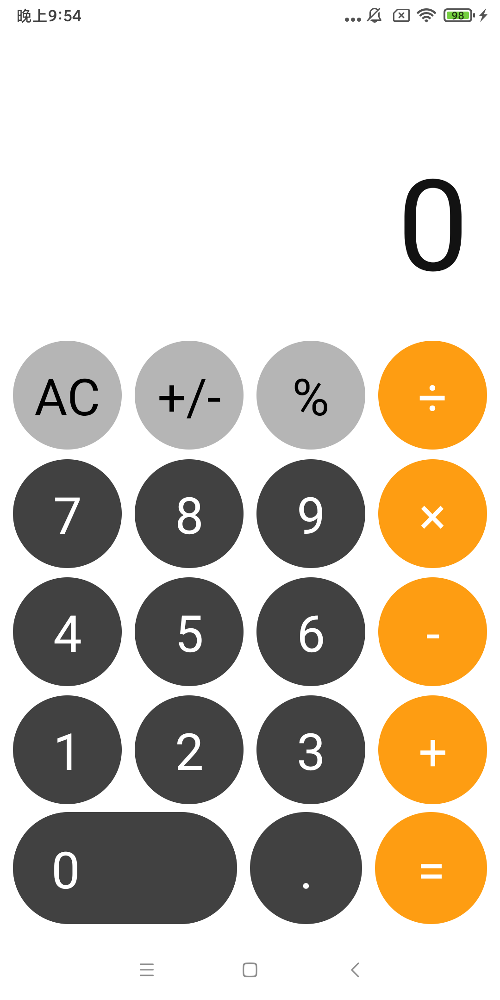
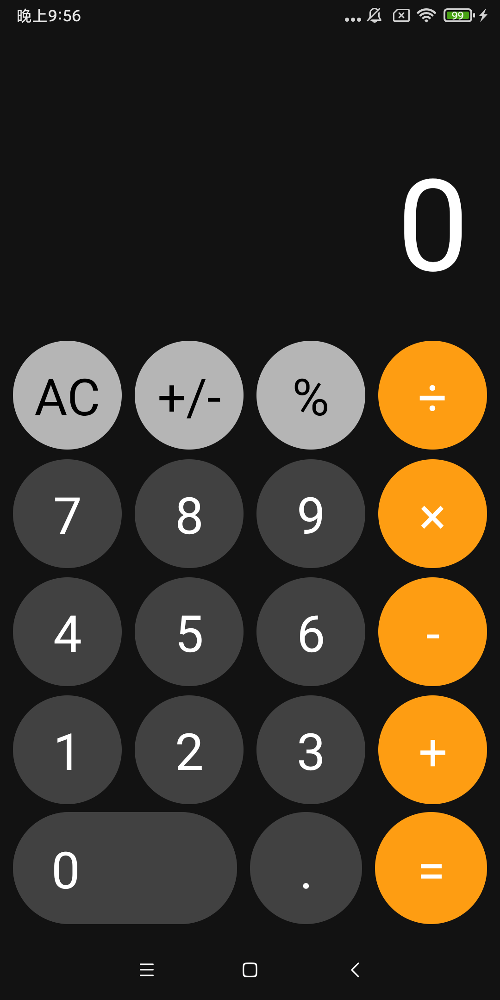

# CopyingIosCalculator
本项目在直播教学版本的基础上开发，功能和界面参考IOS手机上的计算器实现。

## 概要
本项目基于Jetpack compose实现，计算能力使用[ExprK](https://github.com/Keelar/ExprK)，支持深色主题和横竖屏两种显示模式。   
| Light Theme | Dark Theme |
| ---         | ---        |
|  |  |

## 功能特点
> 在live coding的基础上继续补充功能，使功能更接近IOS手机版计算器。具体如下：  
- 使用Material主题，使按钮点击的时候有涟漪的效果
- 支持小数、清空、正负数转换和%（当前数除以100）
- 视图状态更加贴近IOS手机版计算器，÷、×、-和+按钮添加选中状态
- 自动求值，当用户输入第一个数、运算符和第二个数以后，又直接点击了某个运算符，会对前面输入的内容进行运算，并重新赋值给第一个数
- 顶部显示文本支持字体大小自适应，文本复制
- 支持系统深色主题
- 使用美式千分位计数显示结果，如：7777 -> 7,777
- 参考IOS手机计算器的输入输出操作
- 支持横竖屏两种显示模式

## 直播教学版本
> 记录20220807晚王老师（Android GDE）直播中参考IOS手机计算器界面写的线上教学代码  
> 直播版本的代码记录在[livecoding](https://github.com/yann02/CopyingIosCalculator/tree/livecoding)分支
